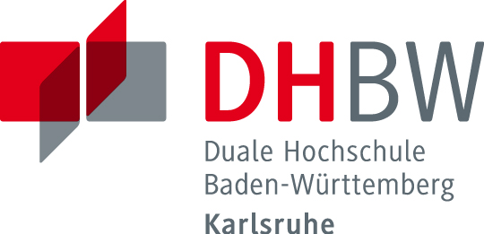

# Participation Request

For my study project, I am looking for participants who are willing to provide their game and calendar data in an anonymized form.

The goal of this project is to analyze the relationship between calendar data and player performance, and to develop a model that can predict a player's performance at a specific point in time. The data sources used are **Counter-Strike 2** (via the FACEIT platform) and **Google Calendar**.

The final application, including the trained model, will be publicly available as a web application after the project is completed.

## Requirements

* At least 100 matches played on FACEIT (ideally 150+)
* Preferably an overlap between match data and calendar data
* Regular use of a calendar with multiple events per week
* Ideally consistent naming of recurring events

## Data Submission

You can provide your calendar data in two ways:

### Option 1 (recommended)

Export your calendar as an `.ics` file and send it to me.

**Steps (browser version only):**

1. Open Google Calendar in your browser: https://calendar.google.com/calendar/
2. Click the gear icon in the top right → “Settings”
3. Select “Import & Export” → “Export”
   *(alternatively: select a specific calendar under “Settings for my calendars” and export it)*
4. A ZIP file will be downloaded. Please send either the ZIP file or the contained `.ics` file via email to: **[playpredictor.de@gmail.com](mailto:playpredictor.de@gmail.com)**

---

### Option 2

Send me a public calendar link (ICS URL).

**Steps (browser version only):**

1. Open Google Calendar in your browser
2. Go to “Settings”
3. Under “Settings for my calendars”, select the calendar you want to share
4. Scroll down to “Access permissions for events”
5. Enable sharing and copy the provided link
6. Send me the link via email

---

Please also include your FACEIT username.

## Note

* All data will be anonymized and used exclusively for scientific purposes. The content of calendar entries will not be analyzed semantically. Instead, only whether events are identical is evaluated. For this purpose, event content (e.g., title or description) is stored in an irreversibly encrypted form. Additionally, timestamps and durations of events are taken into account.

* The analyzed time period can be limited to an active phase of approximately 4–8 weeks (e.g., a period with regular gameplay). Additionally, if available, calendar data from approximately the 4 weeks prior can be provided to capture contextual patterns such as routines.

* The data will be deleted after the completion of the thesis.

* By providing your data, you agree to the processing as described [here](/CONSENT.md)

## About the Project

This project is conducted as part of my Bachelor's degree in Computer Science at the Baden-Wuerttemberg Cooperative State University (Duale Hochschule Karlsruhe).

If you have any questions or would like more information about the project, feel free to contact me at **playpredictor.de@gmail.com**.

Thank you very much for your support!
